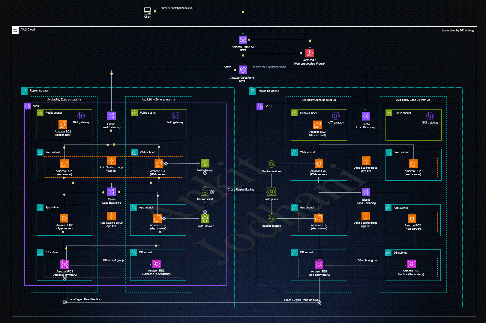

## 🚀 CloudOps-2nd-10weeks-main - 3 Tier Application

✨ This repository is created to learn and deploy a 3-tier application on AWS cloud. This project contains three layers: Presentation, Application, and Database.

### 🏠 Architecture



### Tech Stack
- React 
- Node.js
- MySQL

**Note:** You should have Node.js installed on your system. [Node.js](https://nodejs.org/)

👉 Let's install dependencies to run the React application:

1. Create RDS database in private subnets.
2. Create two private servers in private subnets — one for frontend and another for backend.
3. Create two target groups (TG) and load balancers — one for frontend and another for backend.
4. Create both load balancers in public subnets only, and ensure they are internet-facing because internal load balancer does not work for our project.
---
## Step-1: Connect to Backend Server:
```bash
git clone https://github.com/satyammaurya-cloud/2nd10WeeksofCloudOps-main.git
cd /2nd10WeeksofCloudOps-main/backend
```
- Edit the `.env file` at the following path; if it doesn't exist, create it: `CloudOps-2nd-10weeks-main.git/backend/.env`

Add/Update the following content:
```plaintext
DB_HOST=book.rds.com   # Change RDS endpoint
DB_USERNAME=admin      # Change to your RDS username 
DB_PASSWORD="satyam"   # Change to your RDS password
PORT=3306
```
#### Install MariaDB server:
```bash
yum install mariadb105-server -y
```
-> SSH into the backend server and run `test.sql` script to create tables and records:
```bash
mysql -h <book.rds.com> -u <admin> -p<password> < test.sql
```
---
## Step-2: Backend Deployment Process:
```bash
sudo dnf install -y nodejs
cd backend
npm install
npm install dotenv
npm install -g pm2
pm2 start index.js --name node-app
pm2 startup
sudo systemctl enable pm2-root
pm2 save

```
-> After deployment, create backend target group and load balancer, then verify if it's responding with "hello".

---
## Step-3: Frontend Deployment Process:

```bash
git clone https://github.com/CloudTechDevOps/2nd10WeeksofCloudOps-main.git
cd client 
```
#### .edit the config.js file

```bash
vi client/src/pages/config.js
const API_BASE_URL = "http://learnwithsatyam.in";
```
**Note:** in above line change to your backend loadbalncer url.

`const API_BASE_URL = "http://backend-loadbalancer-url";`
```bash
sudo dnf install -y nodejs
sudo yum install nginx
sudo systemctl start nginx
sudo systemctl enable nginx
```
### Then go to the client directory and run the following commands:

**Use:** `npm run build` 
- When preparing the app for deployment (e.g., to a server or hosting services like AWS, Netlify, or Vercel)

**Use:** `npm start`
- During development or to start the app (commonly used for development servers or backend apps)

```bash
npm install 
npm run build
sudo cp -r build/* /usr/share/nginx/html
```
##### Your frontend part is completed now.
- After that create frontend TG and loadbalncer and check your loadbalncer is giving project output along with books.
- Test to add the books
---
## Step-4: Reverse Proxy:
- If you want to use an **internal load balancer,** please follow the process below.

**Reverse Proxy & Backend Setup (Amazon Linux):**

- This configuration uses **Nginx** as a reverse proxy to serve the React frontend and proxy API requests to a backend running on a private IP or internal load balancer.

**Files:** e.g., `proxy.conf` — Nginx server block (this file).

### Behavior summary (from `proxy.conf`)
- Listens on port 80.
- Routes requests starting with `/api/` to private ip or loadbalncer.
  - Example: `GET /api/books` -> proxied to private ip or loadbalncer
- Serves a React single-page app from `/usr/share/nginx/html` and falls back to `index.html` for client routes.

## Install Nginx on Amazon Linux 2
- Run the following on the public-facing EC2 (nginx) instance.
- After cloneing your `config.js` file url must be `/api` only
once check in your config file below one is commented or uncommented if commented please uncomment and build the package.
```
const API_BASE_URL = "/api";       # For reverse proxy it is mandatory so dont change
```

```bash
sudo yum update -y
sudo yum install -y nginx
sudo systemctl enable --now nginx    # Enable and start nginx
```
##### Create a proxy file and paste the file from git and change the backend private ip if you are using internal loadbalncer change it. 
```bash
sudo vi /etc/nginx/conf.d/reverse-proxy.conf
```
#### Paste below file and change loadbalancer url.
```
server {
    listen 80;
    server_name _;

    #  API reverse proxy (WITH PATH FIX)
    location ^~ /api/ {
        proxy_pass http://backend-loadbalncer-url/;
        proxy_http_version 1.1;

        proxy_set_header Host $host;
        proxy_set_header X-Real-IP $remote_addr;
        proxy_set_header X-Forwarded-For $proxy_add_x_forwarded_for;
        proxy_set_header X-Forwarded-Proto $scheme;
    }

    # React build
    root /usr/share/nginx/html;
    index index.html;

    location / {
        try_files $uri $uri/ /index.html;
    }
}
```
**Verify:** Test and reload nginx:

```bash
sudo nginx -t
sudo systemctl reload nginx
```
---
### Deploy React build to Nginx:
- On the machine where you build the React app (or directly on the nginx server):

```bash
# build (on your dev machine or CI)
npm install
npm run build

# Copy the build files to nginx root on the nginx host
sudo rm -rf /usr/share/nginx/html/*
sudo cp -r build/* /usr/share/nginx/html/

# reload nginx
sudo systemctl reload nginx
```
- If your React app expects the app to be served at `/` this config will work as-is because the `location /` block uses `try_files` to return `index.html` for client routes.

### Sample Backend Setup (Amazon Linux) — Node.js / Express
- These instructions create a minimal API that listens on port 80 and matches the `proxy_pass` target.


**Thank you so much for reading..😅**
